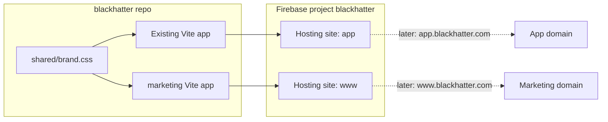

# Sales site in this repo, split-ready

You do **not** need a new GitHub repo or a second Firebase *project*. You do need a second **app folder** and a second **Hosting site** so marketing and the product can live on different subdomains later.

A single SPA with `/`, `/pricing`, `/about` and `/app/*` would be simpler today, but extracting that later means rewriting routes, auth redirects, and Firebase rewrites. Two hosting targets from the start avoids that.



## Layout (modest, not a full monorepo)

Leave the current app at the repo root. Do **not** move it into `apps/web`.

- [`src/`](src/) — product (unchanged routes: `/`, `/login`, `/signup`, …)
- `marketing/` — new Vite + React + Tailwind site (same stack as the app)
- `shared/brand.css` — IBM Plex fonts + ink/paper/ember/moss tokens extracted from [`src/index.css`](src/index.css) so the two sites do not drift
- Root [`package.json`](package.json) scripts: `dev:marketing`, `build:marketing`

`marketing/` gets its own `package.json`, `vite.config.ts`, and `index.html`. Locally: app on 5173, marketing on 5174.

## Why not a new repo

- Same brand, copy, and Tailwind tokens already exist (login aside in [`src/features/auth/AuthForm.tsx`](src/features/auth/AuthForm.tsx))
- One `git` history, one deploy pipeline, one Firebase project
- CTAs are just origin URLs (`VITE_APP_ORIGIN/signup`), not a cross-repo integration
- A blog later can replace `marketing/` with Astro without touching the product

A second repo only helps if marketing is owned by a different team or a CMS (Framer/Webflow). That is not the case here.

## Firebase: two Hosting sites, one project

Today [`firebase.json`](firebase.json) has a single `hosting` block serving `dist`. Change it to two targets:

- **app** → `dist` (current SPA rewrites)
- **www** → `marketing/dist` (SPA rewrites for marketing routes)

[`.firebaserc`](.firebaserc) gets hosting targets mapped to two sites in the existing `blackhatter` project (create the second site with `firebase hosting:sites:create`). Default URLs will look like `blackhatter.web.app` and `blackhatter-www.web.app` until custom domains are attached.

Cross-links via env:

- Marketing: `VITE_APP_ORIGIN` (CTAs → `/signup`)
- App: `VITE_MARKETING_ORIGIN` (login/signup “Learn more” → marketing home)

No app route prefix (`/app`). The product keeps `/` as the dashboard because it will be on its own host.

## Marketing pages (v1)

Public routes, no Firebase Auth in this bundle:

| Path | Purpose |
| --- | --- |
| `/` | Hero, problem, 3–4 features (agenda vs objectives, coverage analytics, PDF / `.ics`), CTA |
| `/pricing` | Early-access / free-to-start unless you have numbers; one primary CTA |
| `/about` | Product story from the README |
| `/faq` | Short list: what it is, who it is for, data/export, how to start |
| `/privacy`, `/terms` | Short stubs (needed next to signup) |

Shared marketing chrome: top nav (Product, Pricing, About, FAQ, Sign in, Get started) and footer. Reuse the existing wordmark treatment from [`AppShell.tsx`](src/components/AppShell.tsx).

**Not in v1:** blog. The separate `marketing/` app is the hook for that later.

## App touchpoints (small)

- Add `VITE_MARKETING_ORIGIN` to [`.env.example`](.env.example)
- On login/signup, link the brand/headline side to the marketing site when that origin is set
- Sign-out and `ProtectedRoute` stay pointed at `/login` — no dashboard URL change

## Deploy

```bash
npm run build
npm run build:marketing
npx firebase deploy --only hosting
```

Custom domains (`www` / `app`) are a later Firebase Hosting step; the folder and site split is what makes that a config change instead of a rewrite.
