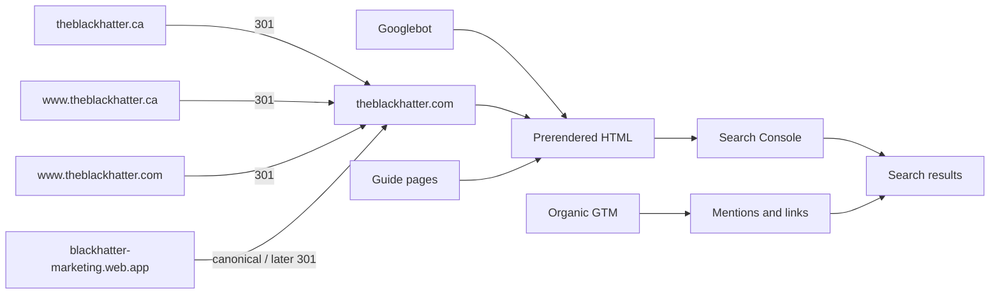

# SEO and organic advertising for Blackhatter

Blackhatter is a **meeting-quality / agenda design** web app (not a security product). The marketing site at [`marketing/`](marketing/) is a Vite + React SPA on Firebase Hosting (`www` target → site `blackhatter-marketing`). Today Google and social crawlers see a nearly empty shell: one global title/description in [`marketing/index.html`](marketing/index.html), client-only titles in [`marketing/src/lib/usePageTitle.ts`](marketing/src/lib/usePageTitle.ts), no sitemap/robots/canonicals/OG/JSON-LD, and unknown URLs soft-redirect home.

Domains you own: **theblackhatter.com** (primary) and **theblackhatter.ca** (301 to .com). Organic only — no paid ads.

---

## Part 1 — Codebase SEO

Keep Vite + React. Do **not** migrate to Next/Astro. Add build-time prerender so each route is a real HTML file with unique head tags. That is the single highest-leverage change.

### 1. Wire custom domains (do this first)

Google consolidates ranking signals on **one** host. Serving the same pages on `.com`, `.ca`, `www`, and `*.web.app` without redirects splits that. Canonical host:

| Role | URL |
|---|---|
| Marketing (canonical) | `https://theblackhatter.com` |
| Marketing www | `https://www.theblackhatter.com` → **301** to apex `.com` |
| Marketing Canada | `https://theblackhatter.ca` and `https://www.theblackhatter.ca` → **301** to the same path on `https://theblackhatter.com` |
| App (canonical) | `https://app.theblackhatter.com` |
| App Canada | `https://app.theblackhatter.ca` → **301** to `https://app.theblackhatter.com` |
| Legacy Firebase | `blackhatter-marketing.web.app` / `blackhatter.web.app` — keep working, but never promote; canonical tags point at custom domains |

Apex `.com` (no `www`) is the public URL: shorter branded links, one host for sitemaps and Search Console.

**Firebase Console (Hosting)**

1. Site **blackhatter-marketing** (`www` target):
   - Add custom domain `theblackhatter.com` (serve content).
   - Add `www.theblackhatter.com` as **redirect** to `theblackhatter.com`.
   - Add `theblackhatter.ca` and `www.theblackhatter.ca` as **redirect** to `theblackhatter.com` (preserve path: `/pricing` on `.ca` becomes `/pricing` on `.com`).
2. Site **blackhatter** (`app` target):
   - Add `app.theblackhatter.com` (serve content).
   - Add `app.theblackhatter.ca` as **redirect** to `app.theblackhatter.com`.

Firebase will show DNS records after each add. Typical pattern:

- **Apex** (`theblackhatter.com`, `theblackhatter.ca`): TXT for ownership, then A/AAAA to Firebase IPs.
- **Subdomains** (`www`, `app`): CNAME to `ghs.googlehosted.com` (or the host Firebase prints), plus TXT if asked.

**Registrar DNS** (do this at wherever you bought the names):

- Enter the Firebase records **exactly**; do not also keep old A records that point elsewhere.
- Wait for SSL (“Connected”) on each domain — often minutes, sometimes up to 24h.
- Do not put both “serve” and “redirect” on the same hostname.

**Code and env (so canonicals and CTAs match DNS)**

- Add `VITE_SITE_ORIGIN=https://theblackhatter.com` in [`marketing/.env.example`](marketing/.env.example) (and production `marketing/.env`). Sitemap, robots, canonicals, OG `og:url`, and JSON-LD `url` all use this.
- Production marketing `VITE_APP_ORIGIN=https://app.theblackhatter.com`.
- Production app `VITE_MARKETING_ORIGIN=https://theblackhatter.com` in [`.env.example`](.env.example).
- Rebuild and redeploy **both** hosting targets after env changes (`npm run build` + `npm run build:marketing` + `npx firebase deploy --only hosting`).
- Document the domain map in [`README.md`](README.md) (replace the old `www.blackhatter.com` / `app.blackhatter.com` note).

**Firebase default URLs:** Hosting cannot 301 `*.web.app` from [`firebase.json`](firebase.json) without looping the custom domain. Rely on canonical tags + Search Console. Optional later: a tiny Host-header Cloud Function if you want a hard 301 off `*.web.app`.

**Do not** run the same English site on `.ca` without the 301. A `.ca` ccTLD is geo-coded to Canada; two live copies would duplicate content. The 301 still catches Canadian users who type `.ca` and passes link equity to `.com`.

### 2. Prerender every marketing route

Google executes JS, but first indexing, Core Web Vitals, and social previews all improve when the HTML already contains the page.

- Split routing so the same tree works in the browser and at build: extract routes from [`marketing/src/App.tsx`](marketing/src/App.tsx) into a shared `AppRoutes`.
- Add `marketing/src/entry-server.tsx` using `renderToString` + React Router `StaticRouter`.
- Switch [`marketing/src/main.tsx`](marketing/src/main.tsx) from `createRoot` to `hydrateRoot` when `#root` is already filled.
- After `vite build`, a small prerender script writes:
  - `/index.html`
  - `/pricing/index.html`
  - `/about/index.html`
  - `/faq/index.html`
  - `/privacy/index.html`
  - `/terms/index.html`
  - later: `/guides/.../index.html`
- Wire it into `marketing/package.json` `build` (and the root `build:marketing` script).

Follow Vite’s [SSG / pre-rendering](https://vitejs.dev/guide/ssr.html#pre-rendering--ssg) pattern: client build + server entry, then emit HTML.

### 3. Per-route SEO head (replace `usePageTitle`)

Add [`marketing/src/lib/seo.ts`](marketing/src/lib/seo.ts) as the single source of truth: `canonical`, `title`, `description`, `og` image. A `SeoHead` component writes `<title>`, `meta description`, canonical, Open Graph, and Twitter tags into the document during prerender **and** on client navigation.

Use **keyword-bearing titles**, not brand-only ones. Always pair “Blackhatter” with “meeting” so Google does not treat the name as black-hat security/SEO.

| Route | Title (direction) | Intent |
|---|---|---|
| `/` | Meeting agenda builder that pressure-tests objectives · Blackhatter | Primary |
| `/pricing` | Free early access · Blackhatter meeting planner | Commercial |
| `/about` | Why meetings fail in the design · Blackhatter | Brand + disambiguation |
| `/faq` | FAQ · Blackhatter meeting agenda software | Long-tail + FAQ rich results |
| `/privacy`, `/terms` | Unique, accurate, no keyword stuffing | Trust |

Canonicals: `https://theblackhatter.com{path}` (no trailing slash except home). Built from `VITE_SITE_ORIGIN`. Never emit `.ca` or `www` in canonicals.

### 4. Crawl files, 404s, and Firebase hosting

**Add to `marketing/public/`:**

- `robots.txt` — allow `/`, `Sitemap: https://theblackhatter.com/sitemap.xml`; do not block JS/CSS.
- `sitemap.xml` — all indexable routes as `https://theblackhatter.com/...` only (never `.ca` or `web.app`). Skip thin legal pages if they stay placeholders, or include them once they are real.
- `og.png` — 1200×630 brand card (ink background, serif headline, ember accent from [`shared/brand.css`](shared/brand.css)). Used by OG/Twitter tags.

**Fix soft 404s** in [`marketing/src/App.tsx`](marketing/src/App.tsx): replace `<Navigate to="/" />` with a real `NotFound` page. Soft-redirecting every unknown URL to home dilutes rankings.

**Update [`firebase.json`](firebase.json) `www` target:**

- Serve prerendered directories as real files (`cleanUrls: true`).
- Stop rewriting **every** path to `/index.html`. Known pages are static; unknown paths should 404 (`404.html`).

Host-to-host 301s (www, `.ca`) are configured in the Firebase **custom domain** UI, not as `firebase.json` `redirects` (those are path-only and would loop if pointed at the same site).

### 5. Structured data and on-page HTML

JSON-LD in the prerendered head (`url` = `https://theblackhatter.com`):

- **Organization** + **WebSite** on home (name, url, description: meeting quality, not security).
- **SoftwareApplication** on home/pricing (free early access, WebApplication, audience: facilitators / meeting owners).
- **FAQPage** on `/faq` from the existing `faqs` array in [`marketing/src/pages/Faq.tsx`](marketing/src/pages/Faq.tsx).

On-page tweaks:

- FAQ questions as `h2` inside `
` (currently not headings).
- Add one FAQ: **“Is Blackhatter a security or hacking tool?”** → No; meeting design. The brand name will otherwise attract the wrong queries and confuse Google.
- Home H1 can stay voice-led; add a visible supporting line that includes “meeting agenda” (already close in the hero subcopy).
- Footer: keep Privacy/Terms; add `rel` on external links later.

### 6. Measurement (required even with no ads)

Organic work is blind without this. No ad pixels.

- **Google Search Console**
  - Add a **Domain** property for `theblackhatter.com` (DNS TXT — covers apex, `www`, `app`).
  - Add `theblackhatter.ca` as a Domain property too, only to confirm Google sees the 301s. Do **not** submit a sitemap on `.ca`.
  - Submit `https://theblackhatter.com/sitemap.xml` on the `.com` property. Request indexing for `/` and `/faq`.
- **GA4** (or Plausible if you prefer no cookies) on the marketing site only: page views + outbound clicks to `VITE_APP_ORIGIN` signup. Set the stream URL to `https://theblackhatter.com`.

Optional later: `google-site-verification` meta if you verify via HTML file instead of DNS.

### 7. Thin content → a few guide pages (ranking surface)

A six-page brochure will not rank for “meeting agenda builder” against Fellow, Notion templates, etc. Add **3 prerendered guides** under `/guides/...`, linked from home/footer. Same stack, no CMS.

Suggested first set (match what the product actually does):

1. **How to build a meeting agenda from objectives** — Decide / Align / Inform / etc.
2. **Meeting pre-read: what to send before the hold** — PDF pre-read story.
3. **How long should this meeting be?** — duration vs. hold; lightly mention cost analytics.

Each guide: unique H1, 800–1200 words, internal links to `/`, `/faq`, `/pricing`, CTA to signup. Add them to the sitemap.

Do **not** write a blog engine in this pass.

### Out of scope for this code pass

- Rewriting Privacy/Terms into real legal copy (needed for trust, not for ranking).
- Self-hosting IBM Plex (minor CWV; skip unless fonts show up as a bottleneck).
- Product-app SEO (`app.theblackhatter.com`) — keep `noindex` on the authenticated app if it is ever crawlable.
- Email / MX records for `@theblackhatter.com` (unrelated to ranking).

---

## Part 2 — Organic advertising (no paid spend)

Goal: people searching for **better meetings / agendas / pre-reads** find Blackhatter, and people in facilitator/lead communities hear about it. Do not bid on “black hat” or security keywords.

### Positioning to use everywhere

- **Category:** Meeting agenda builder / meeting-quality tool.
- **Promise:** Pressure-test the meeting against objectives before anyone sits down; export a pre-read and a calendar hold.
- **Audience:** Facilitators, team leads, meeting owners.
- **Public URL:** `https://theblackhatter.com` (never `.web.app`, never `.ca` in bios once redirects work).
- **Disambiguation line (always):** Blackhatter is not a security product.

### Channel plan (in order)

**A. Own the brand and the index (week 1)**  
Domains connected + SSL green. Search Console live on `.com`, sitemap submitted, `site:theblackhatter.com` shows the prerendered pages. Hit `https://theblackhatter.ca/pricing` once and confirm it 301s to `.com`. Share the homepage URL once from your own accounts so Google sees a first referring click. Fix any “Crawled – currently not indexed” pages.

**B. Launch narrative (week 2–3)**  
One tight story, reused:

- **Product Hunt** — “Meeting quality, by design.” First comment = founder story (calendar hold with no plan). Assets: OG image + 3–5 screenshots of agenda + coverage + PDF. Product link = `https://theblackhatter.com`.
- **Indie Hackers** and a **Show HN** only if the product demo is crisp (signup → agenda → PDF in under two minutes). HN punishes vague “meeting tool” posts; lead with the coverage-check mechanic.
- **LinkedIn** (your voice, not a company page first): 4–6 posts over two weeks — one problem (holds with no plan), one screenshot (coverage), one how-to (objectives first), one FAQ/disambiguation.

**C. Communities where the audience already complains (ongoing)**  
Help first, link second. Places that match the FAQ audience:

- Facilitator / workshop Slack/Discords (IAF-adjacent, Liberating Structures, team-coach groups)
- Reddit: r/managers, r/productmanagement, r/scrum — only when someone asks “how do I run this meeting”; no drive-by links
- Engineering/EM forums if you sell “the meeting has a plan before the invite”

Track a simple list of 10 communities. One useful answer per week beats a blast.

**D. Directories and roundups (low effort, lasting links)**  
Submit once the site has unique titles + OG image: Product Hunt (already), AlternativeTo, There’s An AI For That **only if you actually use AI** (you don’t — skip), SaaSHub, BetaList if still in early access. Skip G2/Capterra until you have reviews.

**E. Content as ads (the guides)**  
Treat the three guides as the ad creative: they rank, they get bookmarked, they get linked. Promote each guide once on LinkedIn and in one community. Internally link Product → Guide → Signup.

**F. What not to do**  
No paid Google/LinkedIn. No “black hat” SEO (PBNs, comment spam, keyword stuffing) — especially with this brand name. No buying newsletter blasts until you have a case study. Do not target security/hacking keywords. Do not list `.ca` as a second live site in directories.

### 30 / 60 / 90 day outcomes

- **30 days:** Custom domains live (`.com` serves, `.ca` 301s), technical SEO shipped, Search Console showing indexed `theblackhatter.com` URLs, Product Hunt + LinkedIn launch done, first guide live.
- **60 days:** Three guides indexed, 10 genuine community mentions, branded queries (“theblackhatter”, “blackhatter meeting”) starting to appear in Search Console.
- **90 days:** Decide whether a comparison page (e.g. vs. a Notion agenda template, not vs. Fellow unless you can be honest) or a fourth guide is worth it based on queries you actually get.

Success metrics: Search Console clicks, marketing → signup click-through (GA4 outbound), weekly signups. Not vanity impressions.
